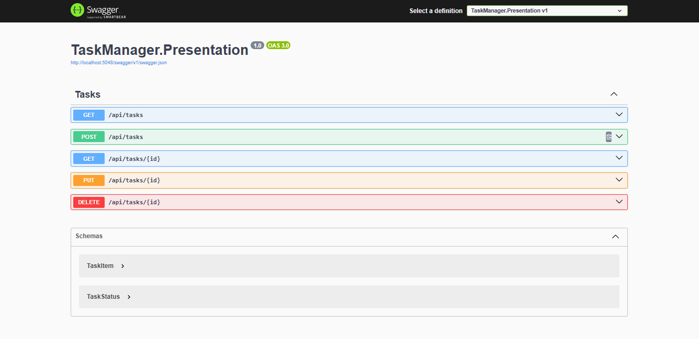

API para gerenciamento de tarefas, desenvolvida em .NET.

## Tecnologias Usadas
.NET 9

Entity Framework Core

SQL Server

Swagger para documentação

## Screenshot

## Clone o repositório
git clone https://github.com/gimidia/TaskManager

cd TaskManagerAPI

## Instale as dependências:
dotnet restore

## Como Configurar o Projeto?
Na pasta TaskManager.Presentation no arquivo appsettings.json, altere a string de conexão:

"ConnectionStrings": {
   "DefaultConnection": "Server=(local)\\sqlexpress;Database=TaskManagerDb;Trusted_Connection=True;"
}

Na pasta TaskManager.Infrastructure\Persistence no arquivo AppDBContext.cs, altere a string de conexão:

if (!optionsBuilder.IsConfigured)
{
    optionsBuilder.UseSqlServer("Server=(local)\\sqlexpress;Database=TaskManagerDb;Trusted_Connection=True;TrustServerCertificate=True;");
}

## Para criar as migrations e o banco de dados, execute:
dotnet ef migrations add InitialCreate --project TaskManager.Infrastructure --startup-project TaskManager.Presentation

dotnet ef database update --project TaskManager.Infrastructure --startup-project TaskManager.Presentation

## Para iniciar a aplicação, execute:
dotnet run --project TaskManager.Presentation

## A API estará disponível em:
http://localhost:5048

## Você pode acessar a documentação Swagger em:
http://localhost:5048/swagger
